# Diasoft Diploma Verification

## Что это за проект

Diasoft Diploma Verification - это сервис для безопасной проверки подлинности дипломов. Проект объединяет три роли в одном продукте:

- `ВУЗ` ведет реестр дипломов, загружает записи вручную или пакетно и может аннулировать диплом.
- `Студент` просматривает свои дипломы и выпускает токены доступа или QR-коды для подтверждения диплома.
- `HR / компания` проверяет диплом по защищенной публичной ссылке, через ручной поиск в кабинете или по API-ключу.

Проект решает проблему разрозненных и медленных процессов верификации: университет ведет единый источник истины, студент управляет доступом к данным, а работодатель получает быстрый сценарий проверки без ручной переписки.

## Архитектура и логика системы

Репозиторий организован как монорепозиторий из двух основных частей:

- `frontend/` - клиентское приложение на `React 19`, `Vite`, `React Router`, `TanStack Query`, `Zustand`.
- `backend/` - API-сервис на `FastAPI`, `SQLAlchemy`, `Alembic`, `Redis`, `PostgreSQL`.

Логика продукта устроена так:

1. ВУЗ регистрируется и наполняет реестр дипломов.
2. Backend хранит записи дипломов, права доступа, токены шаринга и квоты компаний.
3. Студент получает доступ к своим дипломам и может выпускать ссылки или QR-коды для проверки.
4. HR проверяет диплом либо по публичному токену, либо по внутреннему поиску и API-ключу компании.
5. Frontend отображает отдельные маршруты и сценарии для каждой роли, а backend отдает разные уровни данных в зависимости от контекста доступа.

## Быстрый запуск

### Вариант 1. Локальная разработка

1. Запустите backend:

```bash
cd backend
cp .env.example .env
uv sync
uv run alembic upgrade head
uv run uvicorn app.app:app --reload --host 0.0.0.0 --port 8000
```

2. В отдельном терминале запустите frontend:

```bash
cd frontend
npm install
npm run dev
```

3. Откройте приложение по адресу, который покажет Vite, обычно `http://localhost:5173`.

Примечания:

- frontend по умолчанию использует `VITE_API_BASE_URL` или fallback `http://localhost:8000/api/v1`;
- в `backend/.env` для локального фронтенда стоит настроить `CORS_ORIGINS` так, чтобы туда входил адрес dev-сервера, например `http://localhost:5173`.

### Вариант 2. Docker

Для всего стека теперь есть единый корневой `docker-compose.yml`:

```bash
cp .example.env .env
docker compose up --build
```

Этот сценарий поднимает:

- `postgres`
- `redis`
- `migrate` для `alembic upgrade head`
- `api` с запуском `uvicorn`
- `frontend` с nginx и проксированием `/api` на backend

После старта интерфейс доступен по `http://localhost:3000`, backend - по `http://localhost:8000`.

## Структура репозитория

- `frontend/` - клиентская часть, маршруты, UI-компоненты, работа с API и role-based UX.
- `backend/` - FastAPI-приложение, доменные модули, инфраструктурный слой, миграции и тесты.
- `docker-compose.yml` - единая docker-compose конфигурация верхнего уровня.
- `backend/docker-compose.yml` - backend-only compose для узкого сценария, если он вам нужен отдельно.

Если нужна подробная карта внутреннего устройства:

- frontend: см. `frontend/README.md`
- backend: см. `backend/README.md`

## Как пользоваться решением

### Сценарий 1. Работа ВУЗа

- зарегистрировать университетский аккаунт;
- войти в кабинет;
- добавить диплом вручную или загрузить CSV/XLSX;
- открыть карточку записи и при необходимости аннулировать диплом.

### Сценарий 2. Работа студента

- зарегистрировать аккаунт;
- открыть список своих дипломов;
- выпустить токен доступа;
- показать работодателю QR-код или ссылку для проверки диплома.

### Сценарий 3. Работа HR / компании

- зарегистрировать компанию и дождаться подтверждения;
- войти в кабинет и проверить диплом вручную по номеру и коду ВУЗа;
- при необходимости выпустить API-ключи для интеграции внутренней HR-системы;
- использовать публичную ссылку `/verify/:token` для быстрого просмотра результата проверки.

## Скриншоты

### ВУЗ

| Экран | Скрин |
|---|---|
| Вход | 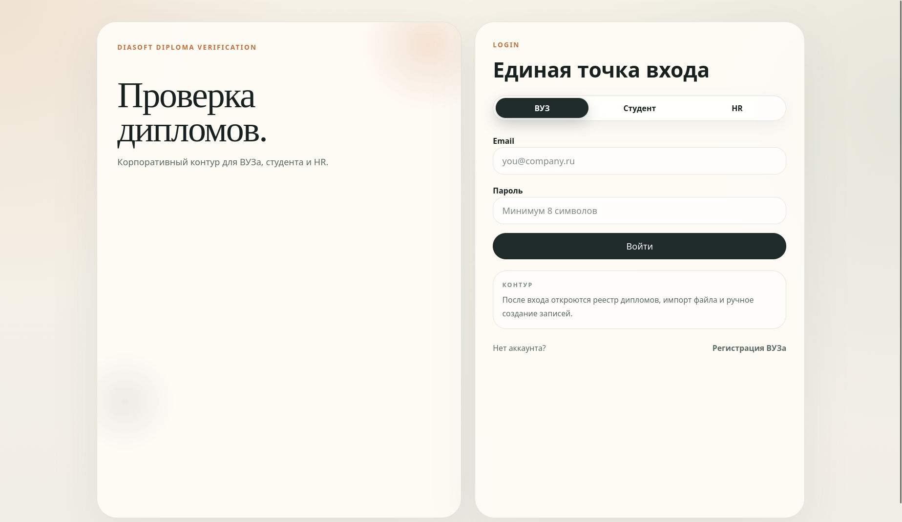 |
| Регистрация | 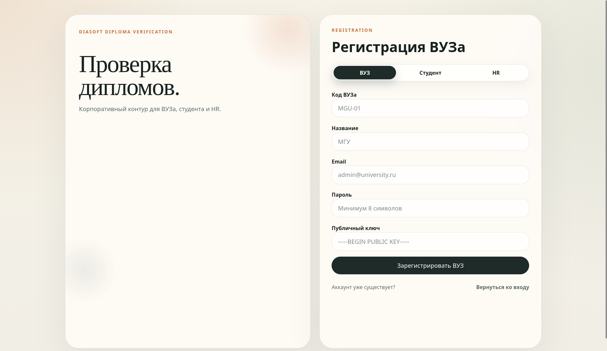 |
| Реестр | 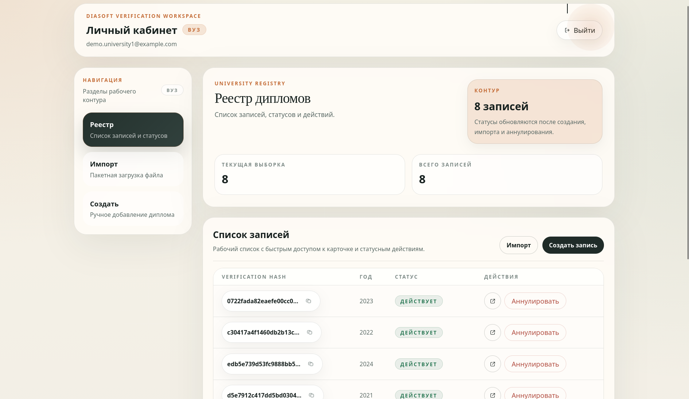 |
| Импорт | 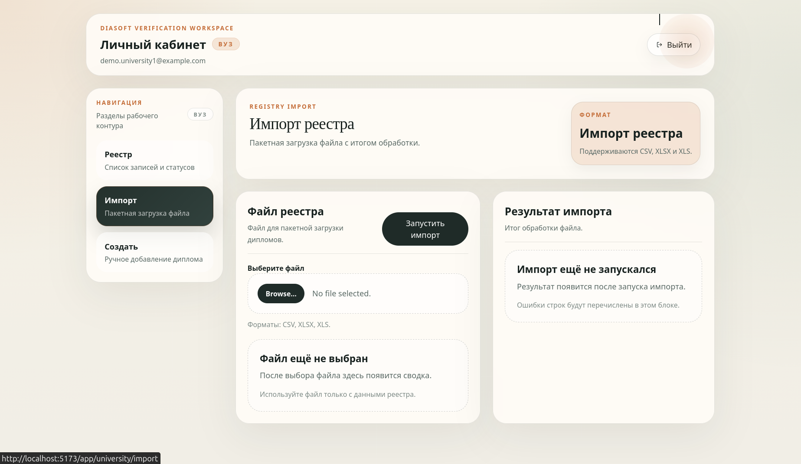 |
| Создание | 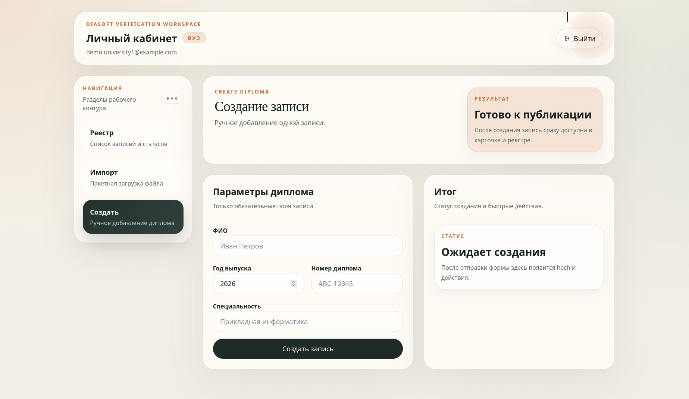 |
| Карточка диплома | 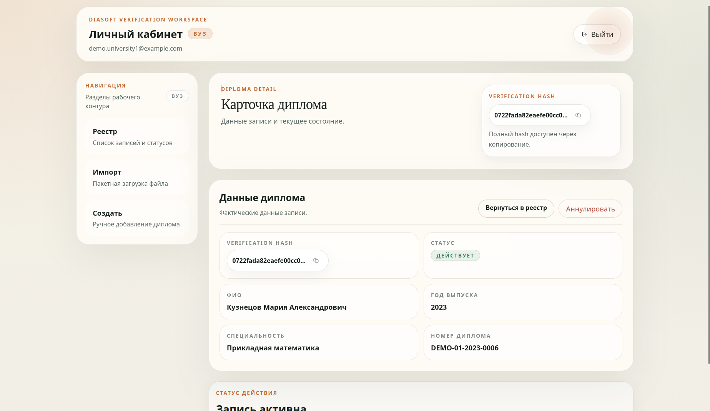 |

### Студент

| Экран | Скрин |
|---|---|
| Вход | 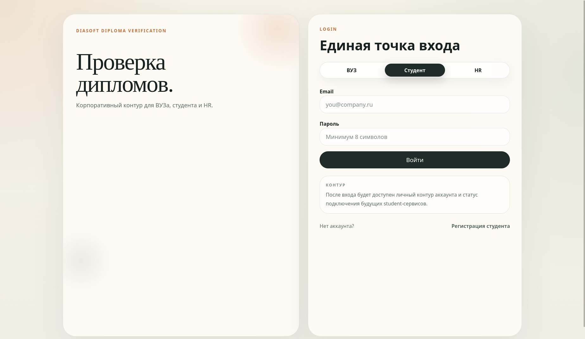 |
| Реестр/главная | 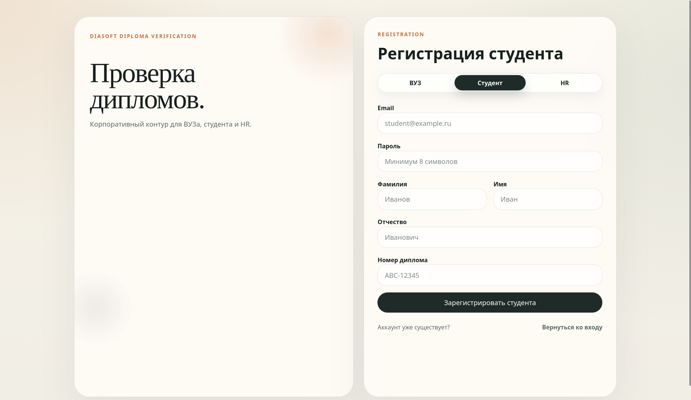 |
| Мои дипломы | 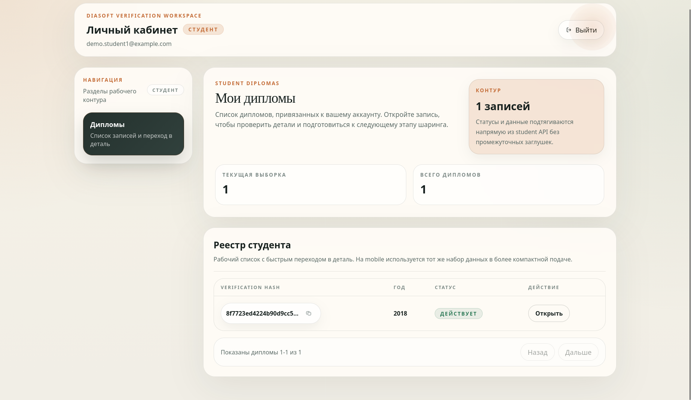 |
| Доступы | 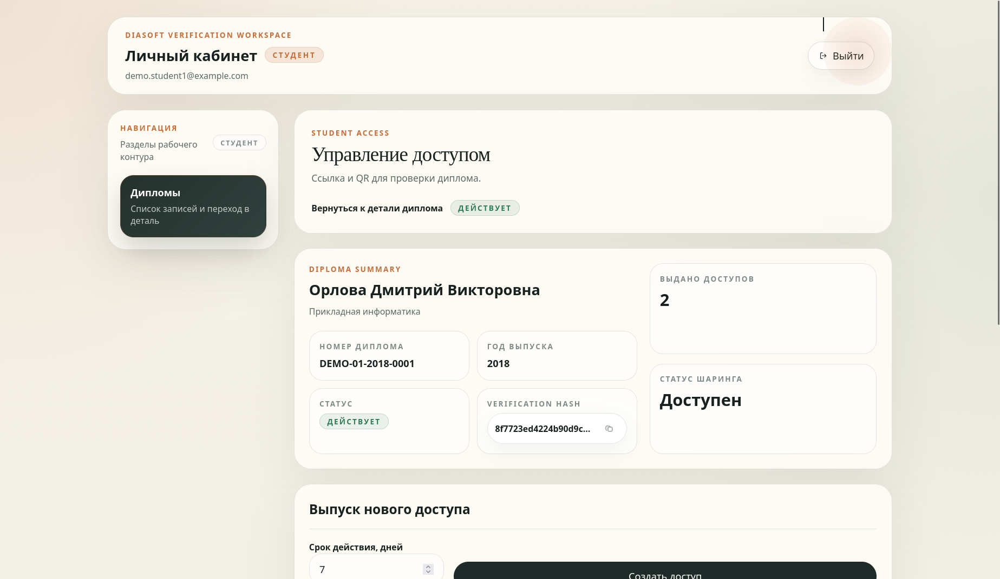 |
| Карточка диплома | 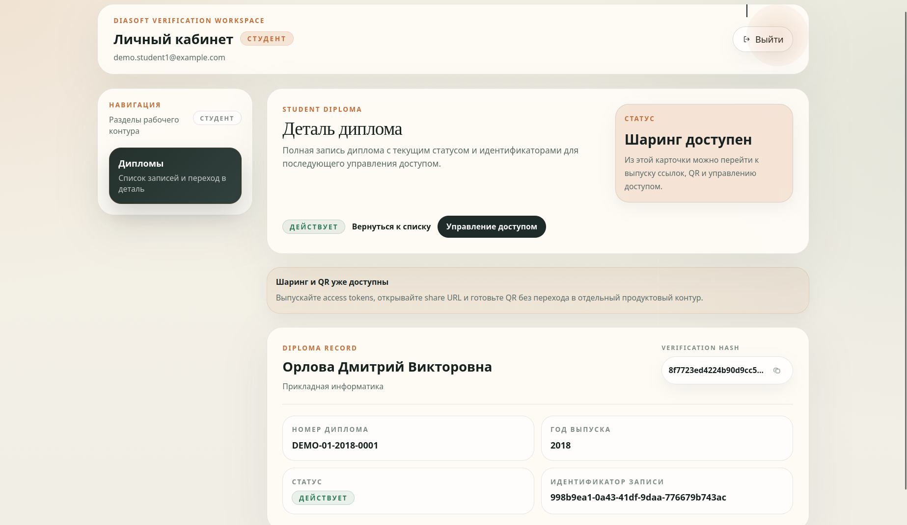 |


### HR / компания

| Экран | Скрин |
|---|---|
| Вход | 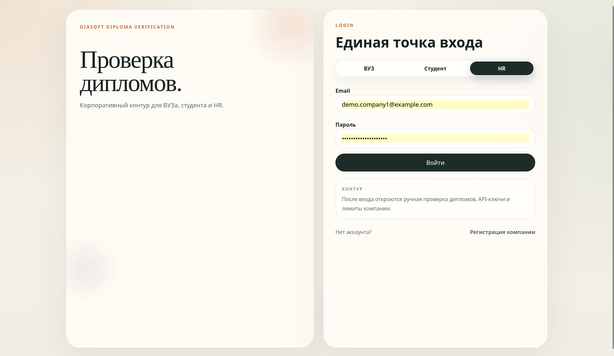 |
| Регистрация | 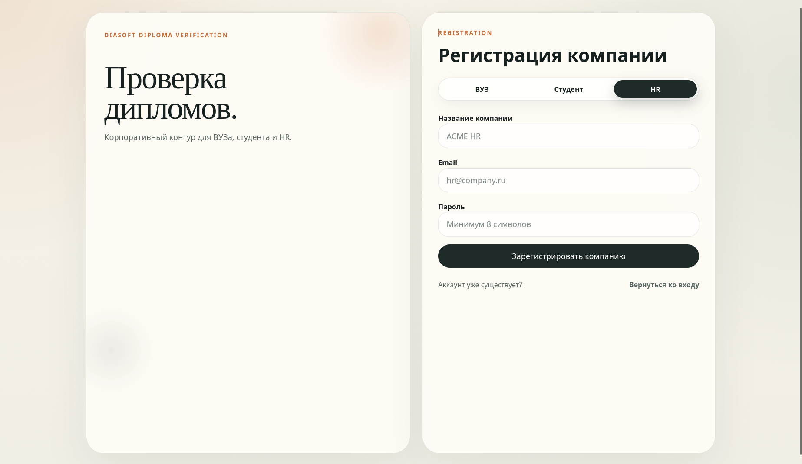 |
| Проверка | 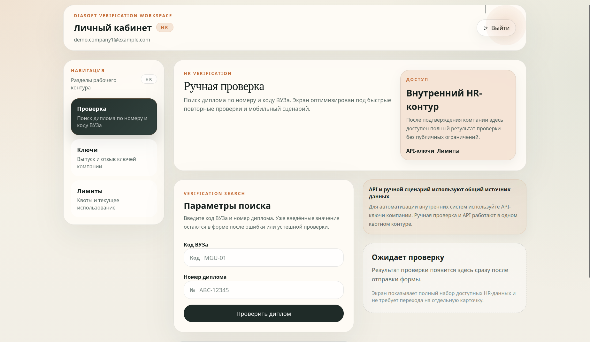 |
| API-ключи | 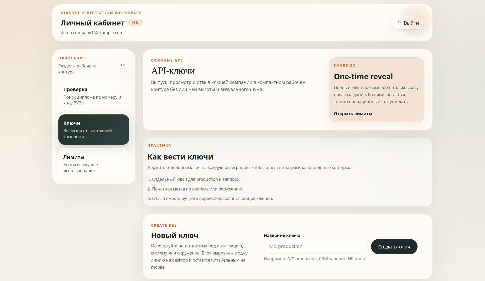 |
| Лимиты | 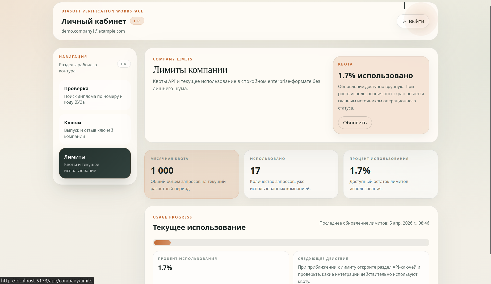 |

## Архитектурная схема
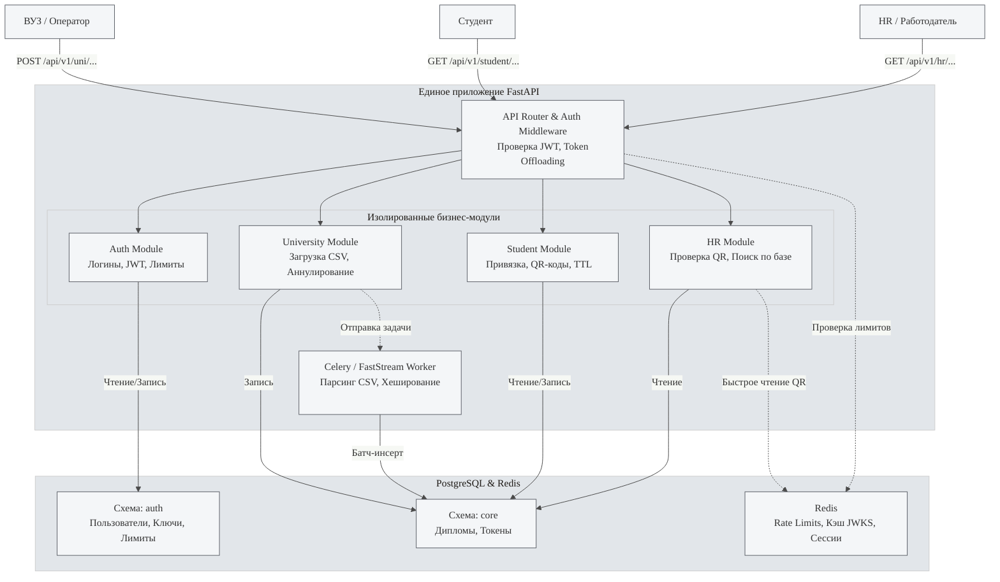

## Команда

- Иван Ткачев - Team Lead
- Степан Кузьменко - Backend Developer
- Владислав Петлюк - Fullstack Developer

